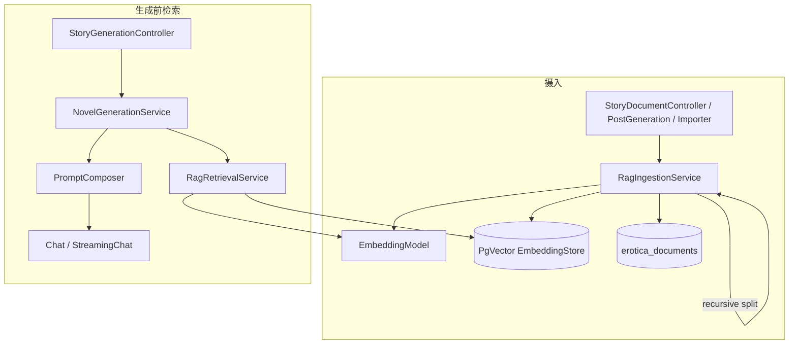

# RAG 调用链路技术说明

本文描述 **EroticaForge** 当前实现中 RAG（检索增强生成）的端到端链路：向量写入、元数据约定、生成前检索、与主 Prompt 的拼接，以及失败降级与相关配置。代码以 `src/main/java` 为准，配置以 `src/main/resources/application.yml` 中 `erotica.*` 与 `langchain4j.open-ai.embedding-model` 为准。

---

## 1. 架构总览

RAG 依赖三类组件：

| 组件 | 实现 | 作用 |
|------|------|------|
| 嵌入模型 | LangChain4j `OpenAiEmbeddingModel`（OpenAI 兼容 `/v1/embeddings`，如本机 llama.cpp） | 摄入与查询时把文本转为向量 |
| 向量存储 | LangChain4j `PgVectorEmbeddingStore`（PostgreSQL + pgvector） | 持久化切块向量与段级元数据 |
| 业务服务 | `RagIngestionService`（写）、`RagRetrievalService`（读） | 切分、写入、检索、过滤、格式化 |

Spring 在 `LangChainConfig` 中注册 **`EmbeddingModel`** 与 **`EmbeddingStore<TextSegment>`** 两个 Bean，摄入与检索共用同一套嵌入端与表结构，保证写入与查询向量空间一致。

---

## 2. 基础设施（Bean 装配）

**类：** `com.eroticaforge.config.LangChainConfig`

- **`EmbeddingModel`**：读取 `langchain4j.open-ai.embedding-model.*`（`base-url` 需含 `/v1`，客户端会请求 `/embeddings`）。
- **`EmbeddingStore<TextSegment>`**：使用 `PgVectorEmbeddingStore.datasourceBuilder()`，表名来自 `erotica.pgvector.table`（默认 `erotica_lc4j_embeddings`），维度来自 `erotica.embedding.dimension`（默认与常见 bge 类模型一致 **1024**；若更换嵌入模型必须同步修改维度并重建或迁移向量表）。

与 RAG 强相关的配置类：

- **`RagProperties`**（`erotica.rag`）：切块大小、检索 `topK`、最低相似度、是否把摘要拼进查询向量、参考库 storyId、是否合并参考库检索等。
- **`GenerationProperties`**（`erotica.generation`）：`reindex-chapter-to-rag` 控制生成完成后是否把新章节再次摄入向量库。

---

## 3. 写入链路（索引 / 摄入）

### 3.1 入口

| 场景 | 调用方 | 服务方法 |
|------|--------|----------|
| 用户上传文档（multipart） | `StoryDocumentController` → `POST /api/stories/{storyId}/documents` | `RagIngestionService.ingestDocument` |
| 纯文本（内部或其它 API 若接入） | 直接调 Service | `RagIngestionService.ingestText` |
| 生成章节回写 RAG（可选） | `PostGenerationService`（当 `reindex-chapter-to-rag=true`） | `RagIngestionService.ingestChapter` |
| 数据分析模块 / 参考语料批导 | `CorpusJsonlReferenceImporter`（调用方可为任务或脚本） | `RagIngestionService.ingestCorpusReference` |

### 3.2 核心流程（`RagIngestionService.ingestTextInternal`）

1. **生成文档 ID**：`UUID` 作为 `doc_id`，与业务表 `erotica_documents` 一行对应。
2. **切分**：`DocumentSplitters.recursive(chunkSizeChars, chunkOverlapChars)`，参数来自 `RagProperties`（默认 512 / 50）。
3. **段级元数据**：对每个 `TextSegment` 写入统一键名（见 `RagMetadataKeys`）：
   - `story_id`：故事隔离；用户文档为路径变量中的 `storyId`；参考库为配置的 `reference-corpus-story-id`。
   - `doc_id`、`chunk_index`、`source`（`upload` / `text` / `chapter` / `reference` 等）。
   - 参考库还可带 `corpus_*` 等分类字段。
4. **嵌入**：`embeddingModel.embedAll(tagged)` → **`embeddingStore.addAll(embeddings, tagged)`** 写入 pgvector。
5. **业务元数据表**：`DocumentRepository.insert` 写入 `erotica_documents`，`metadata` 中含 `chunk_count`、`source` 等。

事务：`ingest*` 方法标有 `@Transactional`，向量与文档元数据在同一事务边界内提交（具体是否与向量扩展完全同一连接取决于数据源与实现，以运行环境为准）。

---

## 4. 检索链路（生成前）

检索发生在 **每次组装用户 Prompt 时**，与流式/同步生成无关，两条 API 共用同一套逻辑。

### 4.1 调用栈

```
StoryGenerationController
  POST /api/stories/{storyId}/generate          → NovelGenerationService.generateBlockingWithMeta
  POST /api/stories/{storyId}/generate/stream   → NovelGenerationService.streamGenerate
        ↓
NovelGenerationService.assembleUserPrompt
        ↓
  StoryStateService.getCurrentState(storyId)     // 摘要、人物状态、上章结尾等
  RagRetrievalService.retrieveRelevantContextResult(userPrompt, state)
  LorebookService.getTriggeredDescriptions(...)   // 与 RAG 并行语义：另一路上下文
  PromptComposer.buildFullPrompt(state, ragContext, lore, userPrompt)
```

### 4.2 `RagRetrievalService` 步骤

1. **查询文本**：默认在 `userPrompt` 基础上，若 `erotica.rag.augment-query-with-summary=true`，则拼接 `StoryState.currentSummary`（见 `buildEmbedInput`）。
2. **查询向量**：`embeddingModel.embed(textForEmbed)` → 得到 `queryEmbedding`。
3. **向量搜索**：构造 `EmbeddingSearchRequest`：
   - `filter`：`dev.langchain4j.store.embedding.filter.Filter`，由 `PgVectorEmbeddingStore` 在 SQL 的 `WHERE` 中应用。逻辑为 `story_id = 当前故事`，或（若 `include-reference-corpus=true`）`(story_id = 参考库 ID AND source = reference)`，二者取并（实现见 `RagRetrievalService.buildRagScopeMetadataFilter`）。
   - `maxResults = topK * searchOverfetchMultiplier`（在已通过 metadata 限定范围的前提下略多取，再截断 top-k）。
   - `minScore = erotica.rag.min-score`。
4. **排序与截断**：按 `score` 降序，取前 `topK` 条。
5. **格式化**：`formatMatches` 为每段加前缀，如 `[回忆1]`、`[参考1]`；标签文案来自 `erotica.prompt.rag.recall-chunk` / `reference-chunk`（`PromptProperties`）。

### 4.3 失败降级

嵌入或检索抛错时，`retrieveRelevantContextResult` 返回 **`RagRetrievalResult.failed(...)`**：`context` 为空串，`failureMessage` 为面向用户的短说明。`NovelGenerationService` 仍将 **`PromptComposer.buildFullPrompt(..., "", ...)`** 继续执行，即 **生成不中断，仅失去 RAG 段**。

- **同步生成**：`GenerateSyncResponse.ragWarning` 带回 `failureMessage`；前端可对 `ragWarning` 提示用户。
- **SSE 流式**：`StoryGenerationController` 在调用流式模型前，若存在 `ragFailureMessage`，会先推送一帧 `{"type":"rag_error","error":"..."}`。注意：当前前端 `streamGenerate` 对任意带字符串字段 `error` 的 SSE 数据会走 `onStreamError`，与致命错误共用路径；若需「仅警告不打断」，需在前后端约定独立字段或类型分支。

---

## 5. 与主 Prompt 的衔接

**类：** `com.eroticaforge.application.service.PromptComposer`

- 方法：`buildFullPrompt(StoryState state, String ragContext, String loreTriggers, String userPrompt)`。
- RAG 结果填入生成模板的占位符 **`{{ragContext}}`**（与 `{{globalSystem}}`、`{{currentSummary}}`、`{{loreTriggers}}`、`{{userPrompt}}` 等并列）。
- 模板正文来自 `PromptProperties`（可在 `application.yml` 的 `erotica.prompt` 或代码默认值中维护）。

因此：**RAG 不是单独 API 返回给前端拼装**，而是在服务端组装 **一整段 user 侧 Prompt** 后交给 `ChatLanguageModel` / `StreamingChatLanguageModel`。

---

## 6. 生成后的可选再索引

**类：** `com.eroticaforge.application.service.PostGenerationService`

在 `processGeneratedContent` 落库章节并更新 `StoryState` 之后，若 **`erotica.generation.reindex-chapter-to-rag=true`**，会调用 `RagIngestionService.ingestChapter`，把本章正文以 `source=chapter` 再次写入向量库，供后续章节检索。

默认配置为 **`false`**，避免重复内容与体积膨胀；开启前建议确认切块策略与业务需求。

---

## 7. 关键配置一览

| 配置前缀 / 键 | 含义 |
|----------------|------|
| `langchain4j.open-ai.embedding-model.*` | 嵌入 HTTP 端（与对话 `base-url` 可不同端口） |
| `erotica.embedding.dimension` | 向量维度，须与嵌入模型一致 |
| `erotica.pgvector.table` | LangChain4j PgVector 表名 |
| `erotica.rag.chunk-size-chars` / `chunk-overlap-chars` | 摄入切分 |
| `erotica.rag.top-k` / `min-score` | 检索条数与阈值 |
| `erotica.rag.augment-query-with-summary` | 是否在查询嵌入中拼接当前摘要 |
| `erotica.rag.search-overfetch-multiplier` | 检索过采样倍数（metadata 范围过滤后再多取若干条） |
| `erotica.rag.reference-corpus-story-id` | 参考库固定 `story_id` |
| `erotica.rag.include-reference-corpus` | 是否在检索中合并参考库 |
| `erotica.generation.reindex-chapter-to-rag` | 是否在每章生成后写入 RAG |
| `erotica.prompt.rag.recall-chunk` / `reference-chunk` | 检索片段展示用标签名 |

---

## 8. 流程图（简图）



---

## 9. 端到端案例（从上传到一轮生成）

下面用一个**虚构但贴近调用顺序**的例子，把「写入」和「检索」串成一条时间线。假设配置为默认值：`chunk-size-chars=512`、`top-k=10`、`augment-query-with-summary=true`、`include-reference-corpus=false`。

### 9.1 背景数据

- **故事 ID**：`a1b2c3d4`（已在业务库里存在对应故事）。
- **用户操作**：通过 `POST /api/stories/a1b2c3d4/documents` 上传 UTF-8 文本文件 `人物设定.txt`，内容节选如下（真实文件可以更长）：

```text
林夏，28 岁，独立咖啡馆店主。性格外冷内热，习惯用笔记本记录熟客偏好。
店名「隅光」，开在老街二楼，雨天会煮姜茶。
```

### 9.2 摄入阶段发生了什么

1. `StoryDocumentController` 校验故事存在后调用 `RagIngestionService.ingestDocument`。
2. 全文被 `DocumentSplitters.recursive(512, 50)` 切成若干 `TextSegment`（本例篇幅短，可能只有 **1 个** 切块）。
3. 每个切块元数据大致为：`story_id=a1b2c3d4`，`doc_id=<新 UUID>`，`source=upload`，`chunk_index=0`，等。
4. `embeddingModel.embedAll` 得到向量，`embeddingStore.addAll` 写入表 `erotica_lc4j_embeddings`（或你在 yml 里改的表名）。
5. `erotica_documents` 新增一行：文件名、storyId、`metadata.chunk_count=1` 等。

至此，**只有该 story 下的向量**在检索时才有机会被选中（除非再开参考库合并）。

### 9.3 生成阶段发生了什么

用户点击续写，例如：

```http
POST /api/stories/a1b2c3d4/generate
Content-Type: application/json

{"prompt": "续写：一个雨夜，林夏打烊前最后一位客人推门进来。"}
```

1. **`NovelGenerationService.assembleUserPrompt`** 拉取 `StoryState`（假设 `currentSummary` 已有简短剧情摘要，例如「上周林夏与供应商谈妥了新豆子。」）。
2. **`RagRetrievalService`** 构造嵌入用字符串（摘要增强开启时）：

   ```text
   续写：一个雨夜，林夏打烊前最后一位客人推门进来。

   上周林夏与供应商谈妥了新豆子。
   ```

   对该整段做 **一次** `embed`，再在向量库里按相似度搜索，先取 `topK * searchOverfetchMultiplier` 条（默认 10×3=30），再**丢弃** `story_id ≠ a1b2c3d4` 的命中。
3. 假设人物设定切块与查询语义足够近，且分数 ≥ `min-score`（0.75），则该切块进入 top 结果。
4. **`formatMatches`** 把它格式成带标签的文本（默认标签来自 `erotica.prompt.rag.recall-chunk`，此处为「回忆」），例如：

   ```text
   [回忆1]
   林夏，28 岁，独立咖啡馆店主。性格外冷内热，习惯用笔记本记录熟客偏好。
   店名「隅光」，开在老街二楼，雨天会煮姜茶。
   ```

5. **`PromptComposer.buildFullPrompt`** 把上面整段填入模板占位符 **`{{ragContext}}`**，再与 `{{currentSummary}}`、`{{userPrompt}}`、Lorebook 触发的 `{{loreTriggers}}` 等拼成**一条完整的 user 侧字符串**，交给主模型（llama-server）生成。

6. **若嵌入服务宕机**：`ragContext` 变为空串，生成仍继续；同步接口返回体里可能出现 `ragWarning`，流式接口可能先推一帧 `rag_error`（见第 4.3 节）。

### 9.4 可选分支：章节回写 RAG

若将 **`erotica.generation.reindex-chapter-to-rag`** 设为 **`true`**，本章生成并落库后，`PostGenerationService` 会再调 `ingestChapter`，把**新生成的正文**以 `source=chapter` 写入向量库。下一轮用户续写时，除了原人物设定，还可能检索到**上一章自己的片段**，形成「越写越能引用前文」的效果（同时向量条数会增加，需自行权衡）。

---

## 10. 相关源码索引

| 模块 | 路径 |
|------|------|
| 摄入 | `application/service/RagIngestionService.java` |
| 检索 | `application/service/RagRetrievalService.java` |
| 检索结果封装 | `application/service/RagRetrievalResult.java` |
| 元数据键 | `application/service/RagMetadataKeys.java` |
| RAG 配置 | `config/RagProperties.java` |
| Prompt 拼装 | `application/service/PromptComposer.java` |
| 生成组装 | `application/service/NovelGenerationService.java` |
| HTTP 入口 | `presentation/controller/StoryGenerationController.java`、`StoryDocumentController.java` |
| 向量与嵌入 Bean | `config/LangChainConfig.java` |
| 参考库导入 | `application/service/CorpusJsonlReferenceImporter.java` |

---

*文档版本与仓库代码同步维护；若调整检索过滤或 SSE 契约，请同步更新本文第 4、5 节。*
