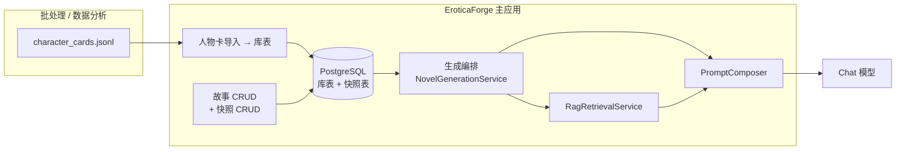
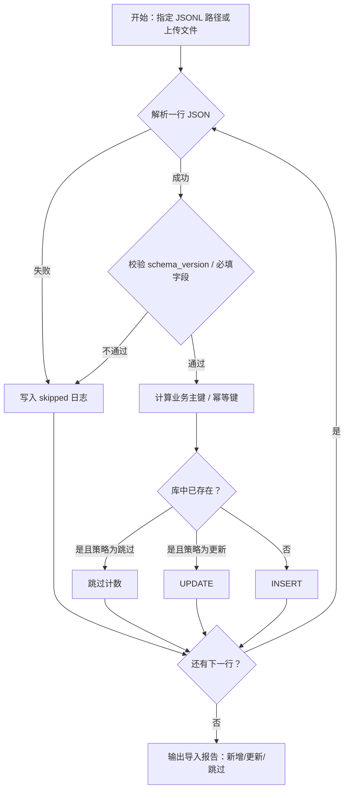
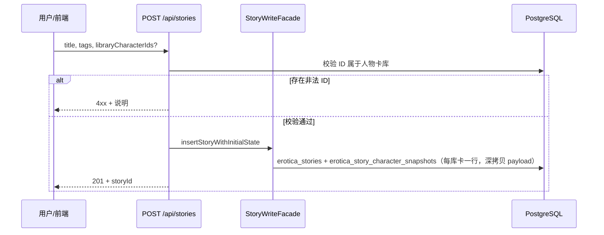
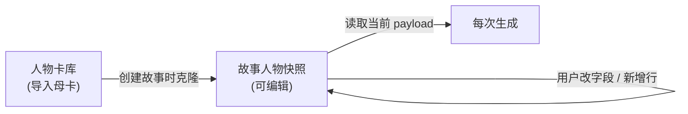
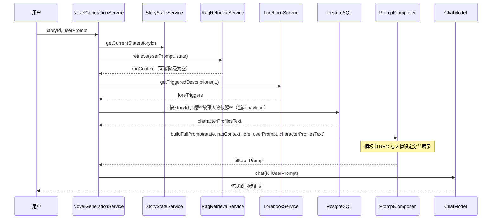

# 人物卡与 RAG 编排 — 业务流程说明

**文档版本**：1.0  
**更新日期**：2026-04-03  
**对应需求**：`docs/product/人物卡导入与故事绑定需求说明.md`、`docs/product/人物卡入库与故事绑定-需求说明.md`  

**业务已定**：人物卡库中 **同名不同源 = 不同卡**；故事侧使用 **可编辑快照**（克隆自库或手写新增），生成只读快照表。

本文描述**业务视角**的数据流与模块协作；具体表名、API 路径以实现阶段为准。

---

## 1. 总体架构（概念）

**要点**：人物设定来自 **本故事的人物快照行**（用户可改、可新增，与库母卡解耦）；RAG 来自 **向量检索**。二者在 `PromptComposer` 中合并为一次 user 文本。

---

## 2. 人物卡导入流程

**与现网对齐**：`dataAnalysisModule/out/character_cards_skipped.jsonl` 可继续作为分析问题数据的旁路；主应用导入宜有独立审计日志或响应体统计。

---

## 3. 新建故事：从库克隆为快照

**后续操作（同一故事）**：`POST/PATCH/DELETE` 快照 — 编辑名称/性格、调整排序、删除条目、**新增无母卡快照**（`cloned_from_library_id` 为空）。列表页可先 `GET /api/character-library?query=`（路径以实现为准）。

### 3.1 快照生命周期（业务视角）

---

## 4. 单次生成：RAG + 人物设定 → Prompt

与当前实现一致的核心顺序：`StoryState` → `RagRetrieval` → `Lorebook` → `buildFullPrompt`。

**模板层变更（规划）**：在 `PromptProperties.Generation.userTemplate` 中增加占位符，例如 `{{characterProfiles}}`，置于「RAG 召回」附近，便于模型同时参考：

- **语料片段**（RAG）：文风、情节、措辞参考。  
- **结构化人设**（故事快照）：性格、关系、口癖等，以用户当前编辑为准。

---

## 5. Prompt 拼装结构（逻辑视图）

以下为**逻辑区块顺序**建议，可与现有 `userTemplate` 合并调整：

1. 系统角色与全局规则（`{{globalSystem}}`）  
2. 当前 Story State（摘要、人物状态、事实、章末）（现有占位符）  
3. **本故事人物设定（快照）**（`{{characterProfiles}}`，来自快照表）  
4. **RAG 召回的相关记忆**（`{{ragContext}}`，来自向量库）  
5. Lorebook 触发（`{{loreTriggers}}`）  
6. 用户当前输入（`{{userPrompt}}`）

这样满足「RAG 时要把人物性格给到提示词」：**同一次调用**内两类上下文并存，且人设不依赖检索排序是否靠前。

---

## 6. 数据模型草案（快照模型）

表名以实现为准；请在 `sql/` 增量脚本中落表并与 `完整 PostgreSQL 与 pgvector 数据模型.md` 同步。

**表 `erotica_character_library`（人物卡库，导入母卡）**

| 列 | 类型 | 说明 |
|----|------|------|
| id | VARCHAR(64) PK | UUID |
| schema_version | VARCHAR(16) | 与 JSONL 一致 |
| source_relative_path | TEXT | 溯源；同名角色靠此与主键区分 |
| content_sha256 | VARCHAR(64) | 幂等 |
| role_index | INT | 同一 JSONL 行内 `characters[]` 下标，避免同文件多角色冲突 |
| display_name | TEXT | 导入时自 `name` 复制，便于列表（母卡侧展示） |
| payload | JSONB | 该角色完整结构化字段 |
| created_at / updated_at | TIMESTAMPTZ | 审计 |

唯一性建议：`UNIQUE(content_sha256, role_index)`（或与 `source_relative_path` 组合，按导入策略定）。

**表 `erotica_story_character_snapshots`（故事人物快照，生成唯一信源）**

| 列 | 类型 | 说明 |
|----|------|------|
| id | VARCHAR(64) PK | UUID |
| story_id | FK → erotica_stories ON DELETE CASCADE | |
| sort_order | INT | 展示与 Prompt 顺序 |
| cloned_from_library_id | VARCHAR(64) NULL | 创建时自库克隆则填库卡 id；用户纯新增则为 NULL |
| payload | JSONB | **可编辑**；与库结构兼容的 JSON，允许用户改 name/personality 等 |
| created_at / updated_at | TIMESTAMPTZ | |

**关系**：快照行 **不** `ON UPDATE CASCADE` 到库表；修改母卡 **不** 自动改历史故事快照。删除库卡时快照默认 **保留**（已实现脱钩）；若产品要级联失效，用软删除或任务清理。

**不推荐**：仅用 `erotica_stories.bound_character_ids` 指库卡 — 无法满足「每故事独立编辑」。

---

## 7. 与现有文档的关系

| 文档 | 关系 |
|------|------|
| `docs/development/数据分析与人物卡提取规划.md` | 上游提取；本文是下游主应用消费与编排 |
| `docs/architecture/RAG调用链路技术说明.md` | RAG 细节；本文补充「人物设定注入点」 |
| `docs/prompts/完整 Prompt 模板.md` | 定稿后应增加 `{{characterProfiles}}` 说明与示例 |

---

## 8. 产品结论（已定稿）

- 同名不同源 → 不同库卡；创建故事后允许继续 **改绑定**（快照增删改排序）。  
- 性格进模型：**DB 快照直出 + 模板分节**，与 RAG 正文块并列，**不做**人设向量检索（P2 另议）。

## 9. 实现备忘

- **P2**：若需「性格也走向量检索」，在快照摘要上建 embedding，与正文 RAG 合并排序。  
- **UI 文案**：编辑绑定/快照「仅影响后续生成」，不自动改写已生成章节。  
- **导入**：`dataAnalysisModule/out/character_cards_skipped.jsonl` 继续用于批处理侧；主应用导入宜自有统计与日志。  
- **落地步骤清单**：`docs/planning/人物卡与快照-实现计划.md`
