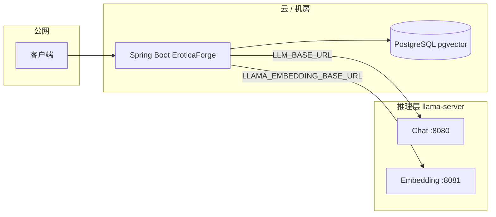
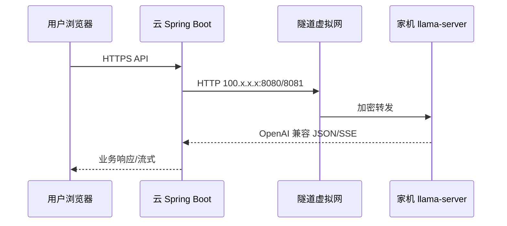

# 服务端部署与推理层架构设计

## 1. 背景与约束

**EroticaForge** 后端（Spring Boot + LangChain4j）通过 **OpenAI 兼容 HTTP API** 调用推理能力：

| 能力 | 配置入口 | 典型端点 |
|------|----------|----------|
| 对话（Chat / 流式） | `langchain4j.open-ai.base-url` → 环境变量 **`LLM_BASE_URL`** | `http://host:8080/v1` |
| 嵌入（RAG 检索与摄入） | `langchain4j.open-ai.embedding-model.base-url` → **`LLAMA_EMBEDDING_BASE_URL`** | `http://host:8081/v1` |
| 向量与业务数据 | `spring.datasource.*` → **`DB_URL`** 等 | PostgreSQL + pgvector |

**约束**：你当前 **llama.cpp（`llama-server`）只能部署在本地**（例如家用 GPU 机器），而 **应用计划部署到公网/云服务器**。两者不在同一台机器时，必须在架构上明确：**谁提供 HTTP 推理端、如何连通、如何保障安全与可用性**。

本文给出 **推荐分层架构** 与 **可选方案对比**，便于你选型和实施。

---

## 2. 目标架构原则

1. **推理与业务解耦**：Java 应用只依赖「可配置的 `base-url`」，不关心 llama.cpp 进程在本机、内网 GPU 机还是隧道另一端。
2. **网络最小暴露**：推理服务默认不应对公网裸奔；优先 **内网 / 专线 / 零信任组网**。
3. **嵌入与向量一致**：更换嵌入模型或部署位置时，**`erotica.embedding.dimension` 与 pgvector 表维度** 须与模型一致；跨环境迁移需固定同一嵌入链路或重建向量。
4. **可观测**：延续现有 `/api/health` 对 DB、LLM、embedding 的探测，在服务端部署后纳入监控与告警。

---

## 3. 推荐方案（按优先级）

### 方案 A：推理层与 API 层同 VPC / 同内网（首选）

在 **具备 GPU 的云主机** 或 **与云主机内网互通的 GPU 节点** 上运行 `llama-server`（对话与嵌入可分两个进程、两个端口，与现有 `8080` / `8081` 约定一致）。

```
[用户/前端] → [公网 LB] → [Spring Boot :8090] ──内网──> [llama-server :8080/:8081]
                                │
                                └──> [PostgreSQL + pgvector]
```

**优点**：延迟低、运维清晰、无需把家用机器暴露到公网。  
**缺点**：需要 GPU 云资源或内网 GPU 服务器成本。

**配置要点**（服务器环境变量示例）：

```text
LLM_BASE_URL=http://10.0.0.50:8080/v1
LLAMA_EMBEDDING_BASE_URL=http://10.0.0.50:8081/v1
DB_URL=jdbc:postgresql://10.0.0.10:5432/vectordb
```

---

### 方案 B：双机部署——应用服务器 + 独立「推理网关」

应用部署在普通云主机（无 GPU）；推理部署在 **另一台内网可达的机器**（可以是机房 GPU、同事内网工作站，通过 VPN 接入同一逻辑网络）。

- 在推理机前可加一层 **反向代理（Nginx/Caddy）**：TLS 终止、限流、访问控制。
- Spring 侧仍只改 **`LLM_BASE_URL` / `LLAMA_EMBEDDING_BASE_URL`** 指向代理地址。

**优点**：计算与 Web 伸缩分离。  
**缺点**：依赖稳定内网或加密隧道质量。

---

### 方案 C：零信任组网（Tailscale / WireGuard 等）连接「本地 GPU + 云端应用」

当 **必须** 继续使用家里/办公室的 llama.cpp 时：云端 Spring Boot 通过 **虚拟内网 IP** 访问家中的 `llama-server`。

```
[云 Spring Boot] ===(加密隧道)=== [家内网 llama-server]
```

**优点**：不必把家宽 **端口映射** 到公网；连接走加密隧道，身份由控制面管理。  
**缺点**：家庭网络抖动、PC 休眠/断电、上行带宽与延迟会直接影响线上；需配套 **监控、ACL 与降级**。

**概要要点**：云服务器与家机都加入同一虚拟内网 → 使用家机在隧道内的地址（如 Tailscale `100.x.x.x` 或 MagicDNS 主机名）作为 `LLM_BASE_URL` / `LLAMA_EMBEDDING_BASE_URL` 的主机名 → 家机防火墙仅放行来自隧道对端的访问。

**完整分步说明、ACL 思路与排障见 [第 8 节](#scheme-c-zero-trust)。**

---

### 方案 D：公网推理网关（不推荐默认启用）

将 `llama-server` 或反向代理直接暴露在公网，用 **TLS + API Key / mTLS + IP 白名单** 保护。

**仅建议在** 无法用 A/B/C 且能接受安全审计成本时采用；务必避免无鉴权开放。

---

## 4. 与本仓库配置的对应关系

部署到服务器时，**无需改代码**，通过环境变量覆盖即可（与 `application.yml` 一致）：

| 变量 | 含义 |
|------|------|
| `LLM_BASE_URL` | 对话 OpenAI 兼容根路径（须以 `/v1` 结尾） |
| `LLAMA_EMBEDDING_BASE_URL` | 嵌入根路径（须以 `/v1` 结尾） |
| `LLM_API_KEY` / `LLAMA_EMBEDDING_API_KEY` | 若推理前启用鉴权，与网关一致 |
| `DB_URL`, `DB_USERNAME`, `DB_PASSWORD` | 云数据库 |
| `EMBEDDING_DIM`, `PGVECTOR_TABLE` | 换嵌入模型时必须与库表一致 |

建议使用 **`application-prod.yml`（勿提交密钥）** 或 **容器编排中的 Secret** 管理上述变量。

---

## 5. 数据与模型一致性

1. **嵌入模型**：若生产环境与开发环境嵌入端 **模型或维度不同**，已有向量与查询向量不在同一空间，RAG 质量会异常；需 **重新摄入** 或 **迁移脚本**。
2. **对话模型**：可独立升级，但与 Prompt、上下文长度（`n_ctx`）相关的限制需在 llama-server 启动参数侧对齐。
3. **备份**：PostgreSQL（含 pgvector）应纳入常规备份；推理机无状态可不备份权重，但建议 **模型文件与启动脚本版本化**（文档或私有制品库）。

---

## 6. 可用性与降级（可选演进）

| 能力 | 建议 |
|------|------|
| 健康检查 | 使用现有 `/api/health`，对 `llm`、`embedding` 做告警 |
| 推理不可达 | 产品层可提示「模型暂不可用」；代码层已有 RAG 失败降级文案，可按需扩展为「跳过 RAG 仅对话」等策略 |
| 多实例 llama | 对话与嵌入分别负载均衡时，须保证 **同请求路由到单实例** 或使用无状态兼容配置 |

---

## 7. 部署拓扑总览（Mermaid）



推理层 `infer` 在 **方案 A/B** 中与 `cloud` 同内网；在 **方案 C** 中经隧道与 `cloud` 相连。

---

<a id="scheme-c-zero-trust"></a>

## 8. 方案 C 详细实施说明（零信任组网：本地 GPU + 云端应用）

本节假设：**PostgreSQL 已在云上**（或与 Spring 同机房可达），仅 **llama.cpp 推理** 跑在家中（或办公室）带 GPU 的 Windows/Linux 机器上。

### 8.1 流量路径与连接方向

1. **用户** → 公网访问 **云上的 Spring Boot**（例如 `https://api.example.com`）。
2. **Spring Boot** 在处理请求时 **主动** 向家中的 `llama-server` 发起 HTTP（Chat 与 Embeddings）。
3. 云服务器 **没有** 公网开放 8080/8081；到「家机」的流量走 **VPN/零信任隧道** 的虚拟网卡，对应用而言等价于「访问一个内网 IP」。

因此：**不需要** 在家用路由器上做 **端口转发** 暴露 llama 端口（这是方案 C 相对「公网映射」的核心安全收益）。



### 8.2 Tailscale 与 WireGuard 怎么选

| 维度 | Tailscale | 自建 WireGuard |
|------|-----------|----------------|
| 上手 | 两端登录同一 tailnet 即可，自动分配 `100.x.x.x` | 需自建对端、密钥、路由；「云主动连家」要处理好 NAT 与可达性 |
| 访问控制 | 管理控制台 **ACL** 可细到「哪台机访问哪台机哪个端口」 | 靠防火墙规则 + 密钥分发，自己维护 |
| DNS | **MagicDNS**（如 `my-gpu-pc`）便于配置可读的主机名 | 通常自行写 `/etc/hosts` 或内网 DNS |
| 适用场景 | 个人/小团队、快速落地 **方案 C** | 已有运维规范、要完全自控链路 |

**实践建议**：先采用 **Tailscale** 跑通；若日后有合规或成本原因再迁到 WireGuard。

### 8.3 Tailscale 实施步骤（推荐路径）

1. **账号与 tailnet**  
   在 [Tailscale](https://tailscale.com/) 创建组织/个人 tailnet（可用 GitHub 等登录）。

2. **云服务器安装**  
   - Linux：按官方文档安装 `tailscaled` 并 `tailscale up`，登录授权。  
   - 记录该机器在管理后台显示的 **Tailscale IP**（形如 `100.x.x.x`）和 **主机名**。

3. **家机（跑 llama 的机器）安装**  
   同样安装并 `tailscale up`，保证与云机出现在 **同一 tailnet**。

4. **验证双向连通**  
   - 在 **云机** 上：`ping` 家机的 `100.x.x.x`，或 `curl http://<家机TS-IP>:8080/v1/models`（需家机已启动 llama 且监听正确，见 8.5）。  
   - 若 ping 通但 HTTP 不通，优先查家机防火墙与 `llama-server` 监听地址。

5. **（可选）MagicDNS**  
   在 Tailscale 管理后台开启 MagicDNS 后，云机可使用 `http://<家机主机名>:8080/v1` 作为 `LLM_BASE_URL`（前提是云上解析与路由均走 Tailscale，以实际 `curl` 为准）。

6. **（可选）子网路由（Subnet Router）**  
   若 llama 跑在 **家里另一台未装 Tailscale 的设备** 上，可在一台「家里的 Tailscale 节点」上宣告子网路由，使云机能访问该局域网 IP。**简单场景**下更推荐 **直接在跑 llama 的机器上装 Tailscale**，减少路由复杂度。

### 8.4 访问控制（Tailscale ACL 思路）

在 Tailscale **Access controls** 中建议 **默认拒绝、按需放行**，例如（逻辑说明，具体语法以官方 ACL 文档为准）：

- 允许 **云服务器节点**（按标签或主机名）访问 **家机节点** 的 **TCP 8080、8081**。  
- 禁止家机主动访问云机除必要管理端口外的服务（按你的最小权限收紧）。  
- 禁止 tailnet 外匿名访问（Tailscale 本身已不暴露到公网，ACL 防止 tailnet 内横向移动）。

这样即使家机上还跑了别的服务，云上也 **只能** 打到你为 llama 开放的端口。

### 8.5 家机 `llama-server` 与防火墙

1. **监听地址**  
   - `llama-server` 需对 **Tailscale 网卡** 可达：常见做法是监听 **`0.0.0.0`**（全接口）或显式绑定 Tailscale 接口 IP。  
   - 若只监听 `127.0.0.1`，则 **只有本机** 能访问，云上 **一定连不上**。

2. **Windows 防火墙**  
   - 为 **专用/域/公用** 中实际生效的配置添加入站规则：允许 **TCP 8080、8081**，来源建议限制为 **100.64.0.0/10**（Tailscale 使用的地址空间）或更严——仅 **云服务器对应 Tailscale IP/32**。  
   - 避免「对任意公网开放 8080」。

3. **Linux（nftables/iptables/firewalld）**  
   同理：仅允许来自 `tailscale0` 接口或来自云机 TS IP 的流量进入 8080/8081。

4. **两个进程两个端口**  
   与当前工程约定一致：**对话** 与 **嵌入** 各起一个 `llama-server`（或等价部署），分别对应 `LLM_BASE_URL` 与 `LLAMA_EMBEDDING_BASE_URL`。

### 8.6 云上 Spring Boot 环境变量

在云服务器（已安装 Tailscale 且已连通家机）上设置，例如：

```text
LLM_BASE_URL=http://100.x.y.z:8080/v1
LLAMA_EMBEDDING_BASE_URL=http://100.x.y.z:8081/v1
```

若 MagicDNS 可用且解析正确，可将 `100.x.y.z` 替换为家机主机名。**不要用** 家宽公网 IP + 端口转发（那是方案 D 思路）。

数据库仍指向云上 PostgreSQL，例如：

```text
DB_URL=jdbc:postgresql://<云数据库内网或托管地址>:5432/vectordb
```

### 8.7 流式输出、超时与 MTU

1. **HTTP 流式（SSE）**  
   Chat 流式会 **长时间占用** 一条 HTTP 连接。若中间还有 **Nginx/Caddy**（一般方案 C 直连 llama 可不经过），必须把 **`proxy_read_timeout`**（或等价项）调到 **数分钟** 以上，否则会中途断流。

2. **Java 客户端超时**  
   LangChain4j 底层 HTTP 客户端若默认读超时偏短，长生成可能报错；若出现「生成一半断开」，需在框架/客户端侧 **调大 read timeout**（具体属性以所用版本文档为准）。

3. **MTU / 分片**  
   部分隧道环境下会出现 **PMTU 黑洞**（表现为大响应卡住、小请求正常）。若遇此类问题，可尝试：隧道侧开启 **MSS clamping**、适当降低接口 MTU，或先在同路径上用 `curl` 对比大小 payload 排障。

### 8.8 带宽、延迟与体验预期

- **上行带宽（家宽 → 云）** 是瓶颈之一：流式 token 与嵌入结果都要经隧道上传，**家宽上行过小** 会导致首字延迟变长、卡顿。  
- **RTT**：云机房与家的地理距离越大，**首包时间** 越长；对流式「逐字」体验仍可能可接受，但要有心理预期。  
- **嵌入批量**：RAG 摄入时若一次嵌入文本很多，payload 更大，更吃带宽与稳定性。

### 8.9 可用性与运维现实

| 风险 | 应对思路 |
|------|----------|
| 家机休眠/关机 | 电源与系统设置关闭休眠；需要时 **WoL**（唤醒后仍需 Tailscale 在线） |
| 断电/断网 | 接受短时不可用；`/api/health` 中 `llm`/`embedding` 变 `down` 时告警 |
| 家宽 IP 变动 | **不依赖** 公网 IP；Tailscale 重连后 `100.x` 通常仍稳定对应同一节点 |
| Tailscale 服务异常 | 罕见；可临时用手机热点验证是否为本地网络问题 |

**结论**：方案 C 适合 **低可用要求** 或 **自用/小范围**；若要 **SLA**，长期仍建议迁到 **方案 A（云 GPU）**。

### 8.10 验证清单（上线前逐项打勾）

1. 家机 `llama-server` 在本机 `curl` 通 `/v1/models`。  
2. 家机 **经 Tailscale IP** 自测（若有第二台设备）或对端云机 `curl` 通同一接口。  
3. 云机 `curl` 家机 TS IP 的 **8080、8081** 的 `/v1/models`。  
4. 云机启动 Spring Boot，访问 `/api/health`，确认 `llm`、`embedding` 为可用状态。  
5. 浏览器或前端走 **公网** 完成一次 **流式生成** 与一次 **带 RAG 的生成**。

### 8.11 WireGuard 简要说明（自选）

若不用 Tailscale：**云与家各配置 WG 对端**，并确保 **云上到「家侧 WG 内网地址」的路由** 存在，且家机 `llama-server` 监听在可被该路径访问的接口上。家庭侧常在 **NAT 后**，需处理 **持续保活（PersistentKeepalive）** 与 **对端可达性**；实现成本高于 Tailscale，适合有现成 WG 基础设施的团队。

---

## 9. 建议的落地顺序

1. 确定推理最终落在 **云 GPU / 内网 GPU / 隧道到家** 中的哪一种（优先 A 或 B；已选 C 则按本文第 8 节执行）。
2. 在云上架设 **PostgreSQL（pgvector）**，迁移或初始化数据。
3. 在推理侧启动 **与线上一致的** `llama-server`（对话 + 嵌入），从 **云机经隧道** `curl` 测通 `/v1/models`、`/v1/chat/completions`、`/v1/embeddings`。
4. 配置应用环境变量，部署 Spring Boot，用 `/api/health` 与一次端到端生成验证。
5. 补上 **日志、监控、备份** 与 **密钥轮换** 流程。

---

## 10. 文档维护

- 与 RAG 细节相关的实现说明见：`docs/architecture/RAG调用链路技术说明.md`。
- 若后续增加「多 profile（local / prod）」或「可切换云 API」，可在本文第 4 节补充环境矩阵表。
- **方案 C** 的逐步操作与排障以本文 **第 8 节** 为准。
