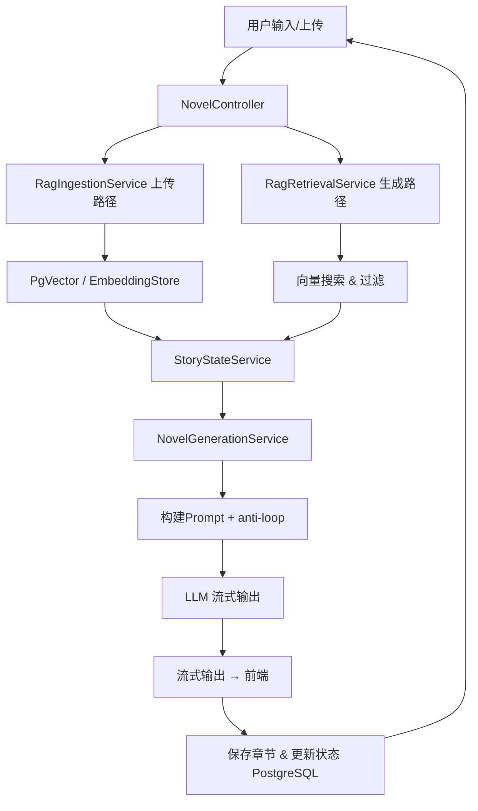
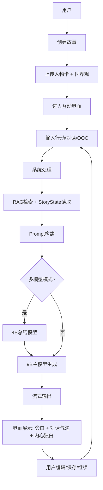

以下是用**文本 + 简易 ASCII** 绘制的核心功能流程图（针对你的本地 NSFW 小说生成项目：Java + Spring Boot + LangChain4j + llama.cpp + Ollama bge-m3 + PostgreSQL/pgvector RAG）。

如果你需要更漂亮的图形版本，可以把下面的内容直接复制到这些工具中自动生成：

- **Excalidraw** / **draw.io**（推荐，手动拖拽最快）
- **PlantUML**（在线：https://www.plantuml.com/plantuml）
- **Mermaid Live Editor**（https://mermaid.live）

### 核心功能流程图（文本版）

```
用户 ─────────────► 前端 UI (Thymeleaf / HTMX / WebSocket)
                          │
                          ▼
                 [1. 用户操作]
             ┌─────────────────────────────┐
             │  - 上传文档（大纲/人物卡/章节） │
             │  - 新建故事 / 选择故事ID      │
             │  - 输入 prompt / OOC指令      │
             └─────────────────────────────┘
                          │
                          ▼
             [NovelController / WebSocket Endpoint]
                          │
               ┌──────────┴──────────┐
               ▼                     ▼
   [上传文档路径]           [续写/生成路径]
       │                           │
       ▼                           ▼
[2. RagIngestionService]    [3. RagRetrievalService]
       │                           │
   ┌─────┴─────┐               ┌─────┴─────┐
   │ 读取文件  │               │ Embed prompt│
   │ 切分chunk │               │ pgvector 向量搜索│
   │ Embedding │               │ top-k 召回   │
   └─────┬─────┘               └─────┬─────┘
         ▼                             ▼
   [PgVector EmbeddingStore]         [过滤 & 组装 context]
         │                             │
         └───────────────┬─────────────┘
                         ▼
             [4. StoryStateService]  ←──────────────┐
                 │  (从 PostgreSQL 读/写)                │
             ┌─────┴─────┐                          │
             │ 读取当前状态│                          │
             │ 生成摘要    │                          │
             │ 更新人物/剧情│                          │
             └─────┬─────┘                          │
                   ▼                                │
                   └───────────────┬────────────────┘
                                   ▼
                       [5. NovelGenerationService]  ←───────┐
                           │                                 │
                       ┌─────┴─────┐                         │
                       │ 构建完整Prompt │                     │
                       │   - 系统提示   │                     │
                       │   - anti-loop  │                     │
                       │   - RAG context│                     │
                       │   - story state│                     │
                       │   - 用户输入   │                     │
                       └─────┬─────┘                         │
                             ▼                                 │
                 [StreamingChatModel → llama-server]          │
                  (temperature 1.05 / repeat_penalty 1.15 等) │
                             │                                 │
                             ▼                                 │
                     流式输出 token                             │
                             │                                 │
                             ▼                                 │
                   [WebSocket / SSE] ────────────────► 前端实时显示
                             │
                             ▼
                   [6. 生成后处理]
                       │
                   ┌─────┴─────┐
                   │ 保存新章节 │
                   │ 更新 StoryState│
                   │ (PostgreSQL JSONB)│
                   └─────────────┘
                             │
                             ▼
                       循环等待用户下一轮输入
```

### 简要文字说明（对应流程图编号）

1. **用户触发**：上传文档或续写故事（最常见入口）
2. **文档摄入**（Ingestion）：只在上传时走一次，切块 → 嵌入（bge-m3）→ 存 PostgreSQL/pgvector（持久化）
3. **检索**（Retrieval）：每次生成前必走，找最相关的剧情/人物/设定
4. **故事状态管理**：防止遗忘/循环的关键中间层（从 PostgreSQL 读最新摘要，生成后更新）
5. **生成核心**：Prompt 组装 + llama.cpp（OpenAI API）流式调用（防循环参数在这里生效）
6. **后处理 & 持久化**：新内容写回 PostgreSQL，确保下次还能召回

### 快速转成图形的方法建议

1. 复制上面的 ASCII 内容到 **Excalidraw**（https://excalidraw.com），手动调整成盒子+箭头（10 分钟搞定）。
2. 用 **Mermaid 流程图语法**（更自动化）：



把这段 Mermaid 代码粘贴到 https://mermaid.live 就能立刻看到图形。

如果你告诉我你更倾向哪种风格（更详细的分支、泳道图、PlantUML 代码、还是只重点生成链路），我可以再给你更精确的版本。需要哪部分再细化？


以下是**完整更新后的《核心功能流程图.md》**，已按照你最新的理解（互动角色扮演小说模式）重新设计和优化，重点突出**人物卡 + 互动对话 + 小说形式回复 + 对话气泡**的流程。

---

**核心功能流程图.md**

**文档版本**：1.1  
**更新日期**：2026-03-24  
**项目名称**：EroticaForge - 本地 NSFW 角色扮演小说生成工具

### 1. 整体核心流程图（文字版 + Mermaid）

```mermaid
flowchart TD
    A[用户] --> B[创建故事 / 选择已有故事]
    B --> C[准备阶段: 上传人物卡 + 世界观 + 大纲]
    C --> D[进入互动写作界面]

    D --> E[输入行动或对话]
    E --> F[系统处理]

    F --> G1[RagRetrievalService\n向量检索相关记忆]
    F --> G2[StoryStateService\n读取当前故事状态]

    G1 & G2 --> H[Prompt 构建\n(系统规则 + 人物卡 + RAG + StoryState + 用户输入)]

    H --> I{是否开启多模型模式?}
    I -->|是| J[总结模型 (4B)\n生成结构化剧情摘要 + 人物状态]
    J --> K
    I -->|否| K[主生成模型 (9B)\n生成小说回复]

    K --> L[流式输出生成结果]
    L --> M[界面展示]

    M --> N1[小说旁白\n(第三人称叙述)]
    M --> N2[人物对话气泡\n(带头像 + 不同颜色)]
    M --> N3[内心独白\n(斜体 + 背景)]

    N1 & N2 & N3 --> O[用户可手动编辑输出内容]

    O --> P[后处理]
    P --> Q1[保存为新章节]
    P --> Q2[更新 StoryState]
    P --> Q3[可选: 重新索引到 RAG]

    Q1 & Q2 & Q3 --> R[返回等待下一轮输入]
    R --> E
```

### 2. 详细流程说明（文字版）

#### 阶段 1：准备阶段
1. 用户创建或选择一个故事
2. 上传/创建**人物卡**（核心！）
3. 上传世界观、大纲、已有章节总结
4. 系统自动将以上内容存入 PostgreSQL（pgvector）用于 RAG

#### 阶段 2：互动写作循环（核心循环）

1. **用户输入**  
   - 描述自己的行动（如“我把手放在她黑丝大腿上”）
   - 直接与角色对话（如“对女主说：今晚跟我走吧”）
   - 混合输入 + OOC 指令

2. **系统后台处理流程**
   - RagRetrievalService：检索最相关的记忆（人物卡、世界设定、之前章节）
   - StoryStateService：读取当前剧情摘要、人物情绪状态、世界 flags
   - Prompt 构建：把系统规则 + 人物卡 + RAG 记忆 + 当前状态 + 用户输入组合成完整 Prompt
   - （可选）总结模型（4B）：先把召回内容压缩成结构化 JSON
   - 主生成模型（9B）：生成小说形式回复

3. **生成结果展示形式**
   - 小说旁白（正常段落）
   - 人物对话 → 以**对话气泡**形式弹出（带角色头像和颜色区分）
   - 人物内心独白 → 斜体 + 浅色背景
   - 重要感官描写 → **粗体**突出

4. **用户后续操作**
   - 直接继续输入下一句（继续互动）
   - 手动编辑生成的任意部分
   - 保存当前轮次为正式章节
   - 重新生成最后一次回复
   - 查看/修改当前 StoryState

### 3. 关键特点说明

- **互动性**：用户可随时与任意角色对话或描述行动，系统以小说形式回复
- **记忆一致性**：依靠 RAG + StoryState 双重保障，长篇不崩
- **可视化**：人物对话以气泡形式显示，更有沉浸感和角色扮演感
- **可控性**：用户可随时手动编辑输出内容，也可使用 OOC 指令精确控制
- **循环闭环**：生成 → 编辑 → 保存 → 继续互动，形成完整创作循环

### 4. Mermaid 代码（可直接复制到 mermaid.live 查看图形）



---

这个版本已经完全符合你对项目的理解：**以人物卡为核心，通过互动对话 + 场景描述来推进剧情，系统以小说形式 + 对话气泡的方式回复**。

需要我把这个新版流程图整合进之前的完整手册中吗？  
或者你想让我继续优化其他部分？

随时告诉我下一步需求！