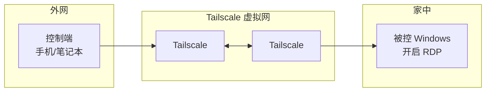

# Tailscale + RDP 远程桌面方案

**文档性质**：个人/办公环境远程访问 Windows 的落地步骤与排错说明。  
**更新日期**：2026-03-31  

---

## 1. 方案概述

**Tailscale** 基于 WireGuard，在多台设备之间建立加密的虚拟局域网（100.x 网段）。设备只要登录同一 Tailscale 账号（或同一 tailnet），即可用 **Tailscale 分配的 IP** 或 **MagicDNS 主机名** 互相访问。

**RDP（远程桌面）** 是 Windows 自带的远程图形会话协议，默认端口 **3389**。

组合后的效果：

- 不在同一物理局域网、无公网 IP、不做路由器端口映射，也能从外网 **安全** 连回家里的 Windows。
- 流量走 Tailscale 加密隧道，**不必把 3389 暴露到公网**，降低被扫描爆破的风险。



---

## 2. 适用场景与限制

| 适用 | 不适用或需额外方案 |
|------|---------------------|
| 被控电脑 **已开机** 且 Tailscale 已连接 | 电脑 **完全关机** 后无法 RDP；需 Wake-on-LAN、智能插座来电启动等 |
| 需要比第三方远控更「原生」的桌面体验 | 仅 **Windows 家庭版** 无官方「远程桌面**被控**」授权时，需升级专业版或使用其他远控 |
| 希望避免公网映射 3389 | 被控机 **睡眠/休眠** 后可能断连，需在电源策略与网卡节能中权衡 |

---

## 3. 前置条件

### 3.1 被控端（家中的 PC）

- **Windows 10/11 专业版、企业版或教育版**（或具备「远程桌面」服务端能力的版本）。家庭版不能作为 RDP **服务端**（可装第三方远控作为替代）。
- 管理员权限（用于开启远程桌面与防火墙规则）。
- 稳定的网络；安装 **Tailscale 客户端** 并登录。

### 3.2 控制端

- **Windows**：系统自带「远程桌面连接」（`mstsc.exe`）。
- **macOS**：Microsoft Remote Desktop（App Store）。
- **iOS / Android**：Microsoft Remote Desktop 或同类 RDP 客户端。
- 同样安装 **Tailscale** 并登录 **与家机同一 tailnet**（同一账号或已被邀请加入的 tailnet）。

### 3.3 账号

- 一个 **Tailscale 账号**（可用 GitHub/Microsoft/Google 等登录）。
- 被控 Windows 上用于登录的 **本地账户或 Microsoft 账户**（RDP 使用 Windows 用户名 + 密码）。

---

## 4. 实施步骤

### 4.1 在被控 Windows 上安装并登录 Tailscale

1. 从 [https://tailscale.com/download](https://tailscale.com/download) 下载 Windows 版并安装。
2. 打开 Tailscale，按提示登录，直到状态为 **Connected**。
3. 在 [Tailscale 管理控制台](https://login.tailscale.com/admin/machines) 中确认该机器已出现，记下其 **Tailscale IP**（形如 `100.x.x.x`）。也可稍后开启 **MagicDNS**，用主机名连接（见下文）。

**建议**：在控制台为该设备设置 **固定/易识别的机器名**，便于辨认。

### 4.2 在被控 Windows 上启用远程桌面

1. **设置 → 系统 → 远程桌面**（或旧版：**系统属性 → 远程**）。
2. 打开 **启用远程桌面**。
3. 确认允许使用远程桌面的用户：默认 **Administrators** 组成员可连；若用普通账户，需把该用户加入 **Remote Desktop Users** 组，或在界面中显式添加。

### 4.3 防火墙（通常可自动）

启用远程桌面后，系统一般会为 **专用/域** 配置文件放行 TCP **3389**。若仍连不通：

1. **控制面板 → Windows Defender 防火墙 → 高级设置 → 入站规则**。
2. 确认存在 **「远程桌面 - 用户模式 (TCP-In)」** 等规则且已启用。
3. 若你只在 Tailscale 接口上访问，可保持默认；**不要**为此去路由器上映射 3389 到公网（除非你很清楚风险并做好加固）。

### 4.4 在控制端安装 Tailscale 并连接 RDP

1. 在笔记本/手机安装 Tailscale，登录 **同一 tailnet**。
2. 确认两台设备在管理控制台中均为 **在线**。
3. 打开远程桌面客户端，**计算机** 处填写：
   - **Tailscale IP**：`100.x.x.x`，或  
   - 若已在 tailnet 开启 **MagicDNS**：`机器名.你的-tailnet名.ts.net`（以控制台显示为准）。
4. 用户名填写被控机上的 Windows 账户（必要时加前缀，如 `.\用户名` 表示本地账户）。

首次连接可能出现 **证书不受信任** 提示：属于自签名证书常见情况，核对指纹或仅在可信网络下可继续。

---

## 5. MagicDNS（可选，但推荐）

在 Tailscale **管理控制台 → DNS** 中启用 **MagicDNS**，可用 **主机名** 代替记忆 IP。

- 机器重连后 Tailscale IP 可能变化（也可在控制台为设备使用 **稳定约定**，具体以 Tailscale 当前文档为准）；MagicDNS 主机名通常更省事。

---

## 6. 安全加固建议

1. **不要将 RDP 端口映射到公网** 作为常规方案；本方案的核心价值是 **仅通过 Tailscale 访问**。
2. 在 Tailscale **Access Controls（ACL）** 中按需限制：哪些标签/用户能访问哪些设备的 **3389**（或整个机器），遵循最小权限。
3. Windows 账户使用 **强密码**；若暴露面仍担心，可启用 **网络级别身份验证（NLA）**（远程桌面设置中常见选项）。
4. 定期更新 Windows 与 Tailscale 客户端。

---

## 7. 常见问题与排错

| 现象 | 可能原因与处理 |
|------|----------------|
| 超时、无法连接 | 两端 Tailscale 是否均 Connected；控制台是否在线；IP/主机名是否填对；被控是否休眠（先唤醒本机再试）。 |
| 提示凭据错误 | 用户名是否含 `.\` 或 `计算机名\`；账户是否在 Remote Desktop Users；是否开启了 PIN 仅登录（部分环境需密码）。 |
| 家庭版无法作为被控 | 换专业版或使用 RustDesk、Parsec 等远控。 |
| 连上后黑屏/卡顿 | 检查被控显卡驱动与 RDP 显示设置；降低颜色深度或关闭部分视觉效果。 |
| 仅局域网能连、Tailscale 不能 | 检查防火墙入站规则是否限制在「专用」而 Tailscale 被归为其他配置文件（少见，可针对性放行 Tailscale 接口或 3389 对 Tailscale 子网）。 |

**快速自检命令（在被控机 PowerShell）**：

```powershell
# 查看监听 3389 的进程（需管理员时 netstat 更全）
Get-NetTCPConnection -LocalPort 3389 -ErrorAction SilentlyContinue
```

---

## 8. 与「远程开机」的关系（扩展阅读）

本方案解决 **已开机** 状态下的远程桌面。若需 **关机/睡眠后唤醒**：

- **Wake-on-LAN**：主板与网卡支持，且在 **同一二层网络或可转发魔术包** 的环境；通过 Tailscale 子网路由或家中常在线设备发 WoL 较常见。
- **来电自启 + 智能插座**：彻底断电后恢复供电可开机，但对硬件与数据有一定风险，需谨慎评估。

上述不属于 Tailscale 必选配置，按需单独设计。

---

## 9. 验收清单

- [ ] 被控机 Windows 版本支持 RDP 服务端，远程桌面已开启。  
- [ ] 被控机与控制端 Tailscale 均为 Connected，控制台可见。  
- [ ] 控制端 `mstsc`（或移动端 RDP）使用 Tailscale IP 或 MagicDNS 主机名可成功登录。  
- [ ] 路由器 **未** 将 3389 暴露公网（除非你有单独硬方案）。  
- [ ] （可选）ACL 已按用户/设备收紧。  

---

## 10. 参考链接

- Tailscale 下载：[https://tailscale.com/download](https://tailscale.com/download)  
- Tailscale 管理控制台：[https://login.tailscale.com/admin/machines](https://login.tailscale.com/admin/machines)  
- Microsoft：在 Windows 上启用远程桌面（以官方当前文档为准）  

本文档为通用运维说明，与具体业务项目无强耦合；实施时以各软件当前版本界面为准。
