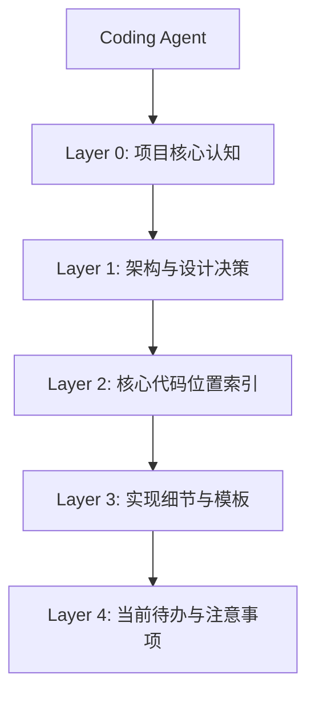

**EroticaForge 项目 - Coding Agent 专用记忆架构**

**版本**：1.0  
**日期**：2026-03-24  
**目的**：为后续写代码的 Agent 提供清晰、高效、可快速检索的记忆结构，让你在开发过程中能瞬间定位关键信息、设计决策和代码位置，避免重复思考或遗忘上下文。

---

### 1. 记忆架构总览（4 层结构）

#### Layer 0：项目核心认知（最先记住）

- 项目本质：**本地互动角色扮演小说生成工具**
- 用户核心玩法：**人物卡 + 行动/对话输入 → 系统以小说形式（旁白 + 对话气泡 + 内心独白）回复**
- 核心目标：**长篇一致性 + NSFW 完全自由 + 流畅写作体验**
- 关键限制：1660S 6GB 显存 → **主力模型推荐 4B**（9B 太慢）

#### Layer 1：架构与设计决策（必须牢记）

- **Clean Architecture** 分层：
  - `presentation/` → Controller / WebSocket
  - `application/` → Service（核心业务）
  - `domain/` → 纯 POJO（StoryState、CharacterCard）
  - `infrastructure/` → PostgreSQL/pgvector、llama.cpp、Ollama（embedding）适配器
- **记忆分层**（最重要）：
  - Layer 1：StoryState（结构化当前剧情 + 人物状态）
  - Layer 2：当前故事向量记忆（只存总结版）
  - Layer 3：人物卡记忆（一致性基石）
  - Layer 4：10G 合集参考库（按题材只读加载）
- **向量数据库策略**：一个主索引 + metadata 过滤（storyId + theme），**坚决不全量存 10G**

#### Layer 2：核心代码位置索引（编码时直接跳转）

| 功能模块               | 主要类文件                                      | 关键方法 |
|------------------------|------------------------------------------------|----------|
| 生成核心               | `application/service/NovelGenerationService.java` | `generateNextChapter()` |
| 生成后处理             | `application/service/PostGenerationService.java` | `processGeneratedContent()` |
| 故事状态管理           | `application/service/StoryStateService.java` | `getCurrentState()`, `updateState()` |
| RAG 检索               | `application/service/RagRetrievalService.java` | `retrieveRelevantContext()` |
| RAG 摄入               | `application/service/RagIngestionService.java` | `ingestCharacterCard()`, `ingestDocument()` |
| Prompt 构建            | `utils/PromptTemplates.java`                  | 所有模板 |
| 库表/常量命名          | `utils/DbTableNames.java`（或 JPA 实体）       | 与 `完整 PostgreSQL 与 pgvector 数据模型.md` 一致 |
| 人物卡分类工具         | `application/service/NovelClassifier.java`    | `classifyFolder()` |

#### Layer 3：实现细节与模板（常用 Prompt / 配置）

- 全局 System Prompt → `PromptTemplates.GLOBAL_SYSTEM_PROMPT`
- 总结模型 Prompt → `PromptTemplates.SUMMARIZER_PROMPT`
- 多模型链 → 在 `NovelGenerationService` 中实现三步链
- RAG 向量 metadata（JSONB）→ 必须包含 `storyId`, `type`, `theme`, `seq`
- 模型配置 → `application.yml` 中 `chat-model` 和 `summarizer-model`

#### Layer 4：当前待办与注意事项（实时更新）

**最高优先级（立即要做）**：
- 实现完整多模型三步链
- 完成 `PostGenerationService`（自动保存 + 更新 StoryState + 增量存向量）
- 实现对话气泡样式的前端展示
- 10G 合集人物卡批量提取工具

**重要编码原则**：
- 每次生成后**必须**更新 StoryState
- 新增内容只存**总结版**，不要存全文
- 人物卡质量是项目一致性的灵魂
- 1660S 6GB 环境下主力模型用 4B（9B 太慢）

---

**使用说明（给 Coding Agent）**

1. **遇到问题时**，先查此文档 → 定位对应 Layer → 找到具体文件/类
2. **新增功能时**，严格遵循 Layer 1~4 的记忆结构
3. **修改 Prompt 时**，必须同步更新 `PromptTemplates.java`
4. **涉及向量存储时**，必须带完整 metadata

此文档为**动态记忆文档**，后续每次重大变更后请更新此文件。

---

**下一步**：  
你是否需要我立即基于这个记忆架构，给你以下任意一个模块的**完整代码**？

1. `StoryStateService.java` + `StoryState.java`
2. `PostGenerationService.java`（含增量存向量 + 清理）
3. `NovelGenerationService.java`（支持单/多模型切换）
4. `RagRetrievalService.java`（带 metadata 过滤）

请直接回复数字，我马上给出完整、可直接使用的代码。  

这样后续编码时，你或任何 coding agent 都能快速定位信息，开发效率会大幅提升。